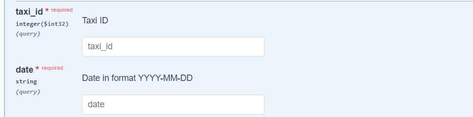

# Fleet Management Software API

## Índice

* [1. Preámbulo](#1-preámbulo)
* [2. Resumen del proyecto](#2-resumen-del-proyecto)
* [3. Funcionalidades](#3-funcionalidades)
* [4. Tecnologías usadas](#4-tecnologías-usadas)

***

## 1. Preámbulo

De acuerdo con
[Wikipedia](https://es.wikipedia.org/wiki/Internet_de_las_cosas),
la internet de las cosas (IoT, por sus siglas en inglés)​ es un concepto que
se refiere a una interconexión digital de objetos cotidianos con internet.

La IoT también plantea retos como el almacenamiento, análisis y
visualización de la gran cantidad de información que genera.

## 2. Resumen del proyecto

Este proyecto es una API REST construida en java para un Software de Gestión de Flotas
para consultar las ubicaciones de los vehículos de una empresa
de taxis.

## 3. Funcionalidades

Esta API proporciona varios endpoints para acceder a diferentes recursos de la 
base de datos, documentados en Swagger.

La API ofrece métodos para listar taxis y trayectorias, así como también para acceder 
al historial de ubicaciones y obtener la última ubicación registrada de cada taxi.

## Endpoints

### 1. Listar taxis 

- Método: GET
- URL: /taxi/all.

### 2. Listar trayectorias

- Método: GET
- URL: /trajectories/all.

### 3. Historial de Ubicaciones

- Método: GET
- URL: /trajectories/byDAteAndId.

Se debe proporcionar el ID del taxi y la fecha

### 4. Última ubicación de cada taxi

- Método: GET
- URL: /trajectories/last-Location

## 4. Tecnologías utilizadas

- Java con Spring Boot y Spring Data JPA: Para el desarrollo de la API REST.

- Swagger: Para documentar la API.

- PostgreSQL con pgAdmin: Como base de datos relacional para almacenar los datos de la aplicación.

